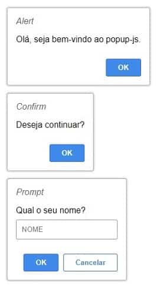

# [POPUP](https://github.com/matheusjohannaraujo/popup)

```javascript
// DEVELOPER INFO
const dev = {
    'autor': 'Matheus Johann Araújo',
    'country': 'Brasil',
    'state': 'Pernambuco',
    'date': '2020-12-10'
}
```

### O <i>POPUP</i> é uma biblioteca que implementa as funções <i>Alert, Confirm e Prompt do JavaScript</i> de forma padronizada e assíncrona em todos os navegadores modernos.

#### Utiliza a tecnologia de [Web Components](https://developer.mozilla.org/pt-BR/docs/Web/Web_Components) que permite a criação de tags customizadas.

#### Com isso, foi criada a tag `<popup-js>`

#### A biblioteca não necessita de instalação de plugins adicionais! Requer somente a inclusão do arquivo de script conforme é descrito abaixo.

<hr>

#### Visualização dos POPUPs:



[Clique aqui para visualizar o funcionamento online](https://matheusjohannaraujo.github.io/popup/)

<hr>

#### Para utilizar a biblioteca é necessário incluí-la no projeto.

- Escreva em seu projeto:

```html
<!-- INCLUINDO BIBLIOTECA -->
<script src="popup.js"></script>
```

#### Você pode usar a biblioteca de duas formas.

- A primeira maneira é escrevendo o nome da TAG ```<popup-js>```

```html
<!-- INCLUINDO BIBLIOTECA -->
<script src="popup.js"></script>

<!-- USANDO POR TAG -->
<popup-js>
    <label slot="title">Alert</label>
    <p slot="body">Hello, welcome to popup-js.</p>
</popup-js>
```

- A segunda forma é através da utilização do JavaScript `popup()`

```html
<!-- INCLUINDO BIBLIOTECA -->
<script src="popup.js"></script>

<!-- USANDO POR JAVASCRIPT -->
<script>
    window.addEventListener("load", async () => {
        await popup()
            .title("Alert")
            .body("Hello, welcome to popup-js.")
            .show()
    })    
</script>
```

<hr>

#### O Web Component ```<popup-js>``` pode ser personalizado de diversas formas.

#### É possível definir um:

* `style` -> Estilo CSS;
* `top` -> Topo de cima;
* `left` -> Lateral esquerda;
* `seconds` -> Tempo do popup em tela;
* `type` -> alert, confirm e prompt são tipos de popup;
* `callback` -> Função chamada quando o popup sair da tela.

#### Para utilizar as funcionalidades descritas acima, use o atributo `data-config="{}"`

#### O atributo `data-config="{}"` deve conter um JSON (objeto chave-valor), com as configurações de exibição do ```<popup-js>```

- Exemplo de uso por TAG `<popup-js>` e por meio da função `popup()` do JavaScript:

```html
<!DOCTYPE html>
<html lang="pt-BR">
<head>
    <meta charset="UTF-8">
    <meta name="viewport" content="width=device-width, initial-scale=1.0">
    <title>example</title>
</head>
<body>

    <!-- INCLUINDO BIBLIOTECA -->
    <script src="popup.js"></script>

    <!--#########################################-->

    <!-- INÍCIO - USANDO ATRAVÉS DE TAG #########-->

    <!-- USANDO ALERT -->
    <popup-js data-config="{
        'type': 'alert',
        'seconds': 5,
        'callback': 'console.log'
    }">
        <label slot="title">Alert</label>
        <p slot="body">Olá, seja bem-vindo ao popup-js.</p>
    </popup-js>

    <!-- USANDO CONFIRM -->
    <popup-js data-config="{
        'type': 'confirm',
        'seconds': 5,
        'callback': 'console.log'
    }">
        <label slot="title">Confirm</label>
        <label slot="body">Deseja continuar?</label>
    </popup-js>

    <!-- USANDO PROMPT -->
    <popup-js data-config="{
            'type': 'prompt',
            'seconds': 5,
            'callback': 'console.log',
            'top': '50px',
            'left': '50px',
            'style': {
                'color': '#000',
                'background': '#fff'
            }
        }">
        <label slot="title">Prompt</label>
        <div slot="body">
            <label>Qual o seu nome?</label>
            <input type="text" placeholder="NOME" id="inp">
        </div>
    </popup-js>
    
    <!-- FIM - USANDO ATRAVÉS DE TAG ############-->

    <!--#########################################-->

    <!-- INÍCIO - USANDO ATRAVÉS DO JAVASCRIPT ##-->
    
    <script>
        window.addEventListener("load", async () => {

            // USANDO ALERT
            await popup()
                .alert()
                .seconds(5)
                .callback("console.log")
                .title("Alert")
                .body("Olá, seja bem-vindo ao popup-js.")
                .show()

            // USANDO CONFIRM
            await popup()
                .confirm()
                .seconds(5)
                .callback("console.log")
                .title("Confirm")
                .body("Deseja continuar?")
                .show()

            // USANDO PROMPT
            await popup()
                .config({
                    'type': 'prompt',
                    'seconds': 5,
                    'callback': 'console.log',
                    'top': '50px',
                    'left': '50px',
                    'style': {
                        'color': '#000',
                        'background': '#fff'
                    }
                })
                .content(`
                    <label slot="title">Prompt</label>
                    <div slot="body">
                        <label>Qual o seu nome?</label>
                        <input type="text" placeholder="NOME" id="inp">
                    </div>
                `)    
                .show()

        }) 
    </script>
    
    <!-- FIM - USANDO ATRAVÉS DO JAVASCRIPT #####-->

</body>
</html>
```
